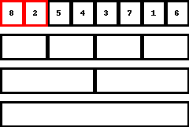

## はじめに
回数制限以内に列を並べ替える事ができたでしょうか? 

今回のゲームの難しいところは、どんな数列が用意されるか分からない状態から始めないといけないというところにあります。  

決められた範囲内ならどんな入力を与えられても、規定通りに動かせば、正しい答えが得られる手続きのことを、「アルゴリズム」と言いますが、今回の問題はまさに数列をソートするようなアルゴリズムを考えようというゲームでした。

ソートアルゴリズムには様々な種類が知られており、実は適切なアルゴリズムを選ぶことで、数列の長さが $8$ であればどんな列が用意されていても $20$ 回以内に並べ替えることが出来ます。 

次節からはいくつかの有名なソートアルゴリズムを紹介していきます。

## シンプルなソートアルゴリズム3種
まずは比較的動きが単純なソートアルゴリズムを3つ程紹介します。

### バブルソート
バブルソートは今回の問題において、恐らく最も直感的なソートアルゴリズムです。  
ざっくりとバブルソートを説明すると、<pre>
隣り合う二つの要素を正しい順番に並べるのを繰り返す。
</pre>
です。  
その手順は以下の通りです。

1. 1番目の要素と、2番目の要素の大小を比較し、1番目の方が大きければ順番を入れ替える. 
2. 2番目の要素と、3番目の要素の大小を比較し、2番目の方が大きければ順番を入れ替える.   
3. 同様に、$3,4$ 番目、$4,5$ 番目、$\dots$、$7,8$ 番目の要素の比較し、適宜交換をする.      
4. 1.~3. を $8$ 回繰り返す.  

以下はバブルソートを実際に行っている様子を表したものです。


手数は多くなってしまいますが、一歩一歩確実に数列が昇順に並んでいくのが分かりやすいソートです。

### 挿入ソート
続いて紹介するソートアルゴリズムは、挿入ソートと呼ばれるものです.  
ざっくりと挿入ソートを説明すると、<pre>
前の要素から順に、正しい位置に入れていく。
</pre>
です。
その手順は以下の通りです。

1. 1番目の要素と2番目の要素を比較し、順番が入れ替わっていれば交換する。  
2. 3番目の要素とその前の要素を比較し、順番が入れ替わっていれば交換する。     
3. 2.で交換した場合、さらにその前の要素を比較し、順番が入れ替わっていれば交換する。  
4. 4番目の要素とその前の要素を比較し、順番が入れ替わっていれば交換し、入れ替えたならさらにその前と比較し...を繰り返す。 
5. これを、繰り返す。 

以下は挿入ソートを実際に行っている様子を表したものです。


### 選択ソート
選択ソートも比較的イメージしやすいソートアルゴリズムです。
ざっくりと選択ソートを説明すると、<pre>
最も小さい要素を探し、それを先頭にもってくるのを繰り返す。
</pre>
です。  
その手順は以下の通りです。

1. $1$ 番目の要素と $2$ 番目の要素を比較する.  
2. 1.で小さかった方と、$3$ 番目の要素を比較する.  
3. 2.で小さかった方と、$4$ 番目の要素を比較する.
4. 以下繰り返して、$1\sim8$ 番目の要素の中で最も小さい要素を特定する.  
5. 4.で特定した最も小さい要素を、$1$ 番目に移動させる. 
6. 1.$\sim$ 4.のようにして、$2\sim8$ 番目の要素の中で最も小さい要素を特定する.  
7. 6.で特定した要素を $2$ 番目に移動させる.  
8. これを、繰り返す.  

以下は選択ソートを実際に行っている様子を表したものです。
  


実際にトランプをソートするときなど知らず知らずの内にこのソートに近いものをしているかもしれません。(私はこれでした。)

### 一旦まとめ
さてここまで3つのソートアルゴリズムを紹介してきました。
どれも、比較的直感的なソートアルゴリズムですが、これらをそのまま今回のゲームに適用すると、確実には $20$ 回以内で並べ替えることは出来ません。  
次の節では、より質問回数が少なくて済むソートアルゴリズムを紹介します。

## より高度なソートアルゴリズム
### マージソート

ざっくりとマージソートを説明すると、<pre>
半分ずつに区切ってソートをし、結果を合わせる。
</pre>
です。  
その手順は以下の通りです。
その手順は以下の通りです。

1. $1$ 番目の要素と $2$ 番目の要素を比較し、昇順に並べる。  
2. $3$ 番目の要素と $4$ 番目の要素を比較し、昇順に並べる。 
3. $5$ 番目の要素と $6$ 番目の要素を比較し、昇順に並べる。 
4. $7$ 番目の要素と $8$ 番目の要素を比較し、昇順に並べる。
5. $1,2$ 番目の要素と $3,4$ 番目の要素を昇順に並べる。
6. $5,6$ 番目の要素と $7,8$ 番目の要素を昇順に並べる。
7. $1,2,3,4$ 番目の要素と $5,6,7,8$ 番目の要素を昇順に並べる。 

ただし、各ステップで数列 $A$ と数列 $B$ の数列の要素を合わせた、 数列 $C$ を作る方法は以下の通りです。   

1. $x=1$, $y=1$ とする。初め、$C$ は長さ $0$ の数列とする。
2. $A$ の小さい方から $x$ 番目の要素と、$B$ のの小さい方から $y$ 番目の要素を比較して、小さい方を $C$ の末尾に入れる。
3. 2.で $A$ の要素の方が小さければ $x$ に、$B$ の要素の方が小さければ $y$ に $1$ 加える。  
4. これを繰り返す。ただし、どちらかの数列の末尾まで調べきったら残りはもう一方の数列の要素を順に $C$ の末尾に入れる。

中々に複雑なので、下のgif画像を見るとイメージしやすいかもしれません。  

以下はマージソートを実際に行っている様子を表したものです。  


やや複雑な方法ですが、この手順に従えば質問回数は最大でも $17$ 回となり、目標を達成できます!!  

## 競技プログラミングでの話
さて、ここまで比較的単純なソートアルゴリズム3種と、複雑だが質問回数の少ないソートを紹介してきました。  
ここからは、これらのソートの違いが競技プログラミングにおいてどのような差異を産むかについてのお話です。

今回のゲームでは、数列の長さは $8$ と小さい値であったため、操作回数にそこまでの違いはありませんでした。  
それでは数列の長さを $N$ だとしたらどうでしょうか?    
この時、それぞれのソートアルゴリズムを適用した場合に、どれぐらいの操作回数を要するかを解析してみると、シンプルなソートアルゴリズムで紹介した方は、大体 $N^2$ 回、マージソートは $N\log_{2}N$ 回となります。(ここでの "大体" とは、$N$ を十分大きくすると、定数倍の範囲で近似できるという意味のため、かなりざっくりとした"大体"です。)  
ここで、下の $N$ と $N^2$ や $N\log_{2}N$ の対応表を見てみましょう。

| $N$ | $N^2$ | $N\log_{2}N$ | 
| --- | --- | --- |
| $10$ | $100$ | $33$ |
| $100$ | $10000$ | $664$ |  
| $1000$ | $1000000$ | $9966$ | 
| $10000$ | $100000000$ | $132877$ | 
| $100000$ | $10000000000$ | $1660964$ | 

このように、$N$ の値が大きくなるにつれて、アルゴリズムの効率の差が大きくなっていきます。  
そして、競技プログラミングで扱うのは効率の差が顕著にでるような大きな対象です。  
そのため、競技プログラミングでは、ただ単に正解を与えるだけでなく、効率よく問題を解けるような解法を考える必要があるのです。

## 最後に
今回紹介出来なかった中にも興味深いソートアルゴリズムはたくさんあります。  
また、シンプルなソートアルゴリズムの方で紹介した方でも、そこから少し工夫を凝らすことで効率の良いアルゴリズムに生まれ変わるといった事もあります。  
このように、単純な並べ替え一つをとっても、アルゴリズムの世界というのは奥深いものなのです。
以上で並べ替えゲームの解説は終了です。  
最後までお読みいただき、ありがとうございました。  
この後におまけとして、ソートアルゴリズムをプログラミングで書いたものを載せておきます。  

## おまけ
今回紹介したソートアルゴリズムを、プログラミングのコードで書いたらどうなるだろうのコーナーです。

### バブルソート(C++というプログラミング言語で書いたもの)
```c++
#include <bits/stdc++.h>
using namespace std;

//これより上は, 最初の内はおまじないのようなものと思って大丈夫

int main() {
    
    int N; //配列の長さ
    cin>>N; //長さを受け取る
    vector<int> A(N); //配列を格納する
    for(int i=0;i<N;i++){
        cin>>A[i]; //配列の要素を受け取る
    }

    for(int i=0;i<N;i++){ //N回繰り返す
        for(int j=0;j<N-1;j++){ //j=0,1,2,...,N-2と順に処理をする.
            if(A[j]>A[j+1]){ //Aのj番目とj+1番目を比較する
                swap(A[j],A[j+1]); //Aのj番目の方が大きければ交換する
            }
        }
    }
    for(int i=0;i<N;i++){// i=0,1,...,N-1と順に繰り返す
        cout<<A[i]<<" \n"[i==N-1]; //配列の値を出力する.  
    }

}
```
### 挿入ソート(Pythonというプログラミング言語で書いたもの)
```Python
n = int(input()) # 要素数
a = list(map(int, input().split())) # 整列したい配列を取得

for i in range(n-1): # 1からn-1まで繰り返し
    j = i+1 # 挿入する値
    while j > 0 and a[j-1] > a[j]: # 挿入する値より前に小さい値があれば
        a[j],a[j-1] = a[j-1],a[j] # 交換していく
        j -= 1

print(*a)
```


### マージソート(C++というプログラミング言語で書いたもの)
(一般的にはマージソートは再帰関数と呼ばれる方法で実装されますが、ゲームに則して非再起で書いたのでかなりごちゃごちゃしてしまいました。)
```c++
#include <bits/stdc++.h>
using namespace std;

//これより上は, 最初の内はおまじないのようなものと思って大丈夫

int main() {

    int N; //配列の長さ
    cin >> N; //長さを受け取る
    int INF = 1e9 + 10;
    int CN, d;
    for (d = 30; d >= 0; d--) {
        if (N & (1<<d)) {
            CN = (1 << d) * 2;
            break;
        }
    }
    vector<int> A(CN, INF); //配列を格納する
    for (int i = 0; i < N; i++) {
        cin >> A[i]; //配列の要素を受け取る
    }

    for (int i = 0; i <= d; i++) {
        int bit = (1 << i);
        vector<int> nextA(CN);
        for (int j = 0; j < CN / (bit * 2); j++) {
            int L = 0, R = 0;
            for (int k = 0; k < bit * 2; k++) {
                if (L >= bit) {
                    nextA[j * (bit * 2) + k] = A[j * (bit * 2) + bit + R];
                    R++;
                }
                else if (R >= bit) {
                    nextA[j * (bit * 2) + k] = A[j * (bit * 2) + L];
                    L++;
                }
                else if (A[j * (bit * 2) + L] < A[j * (bit * 2) + bit + R]) {
                    nextA[j * (bit * 2) + k] = A[j * (bit * 2) + L];
                    L++;
                }
                else {
                    nextA[j * (bit * 2) + k] = A[j * (bit * 2) + bit + R];
                    R++;
                }
            }
        }
        A = nextA;
    }
    for (int i = 0; i < N; i++) {
        cout << A[i] <<" \n"[i==N-1];
    }

}

```